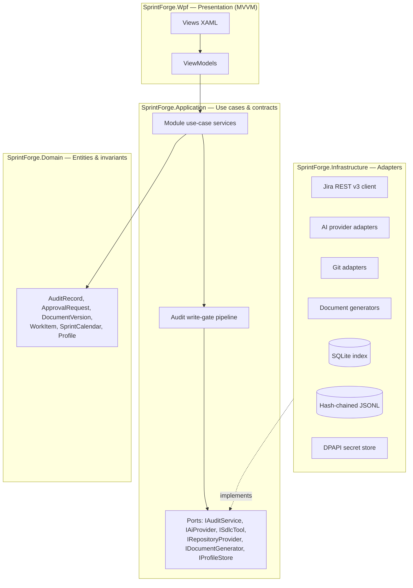
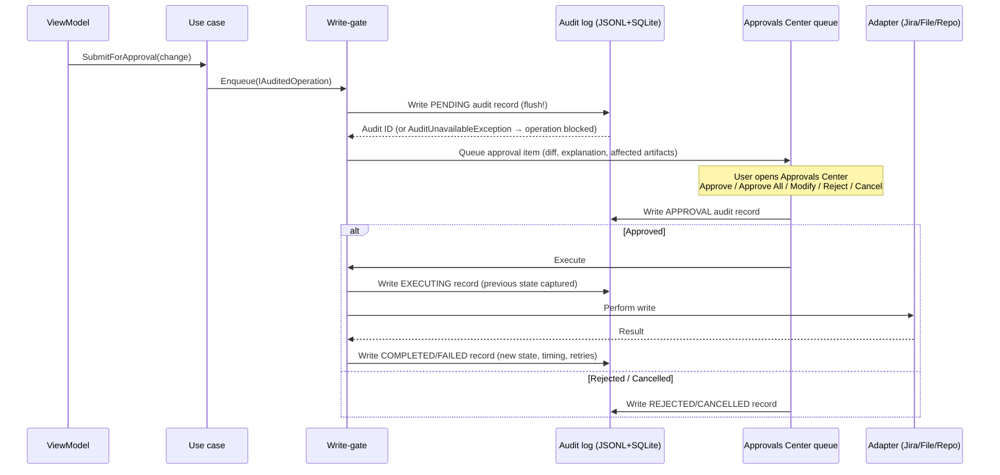
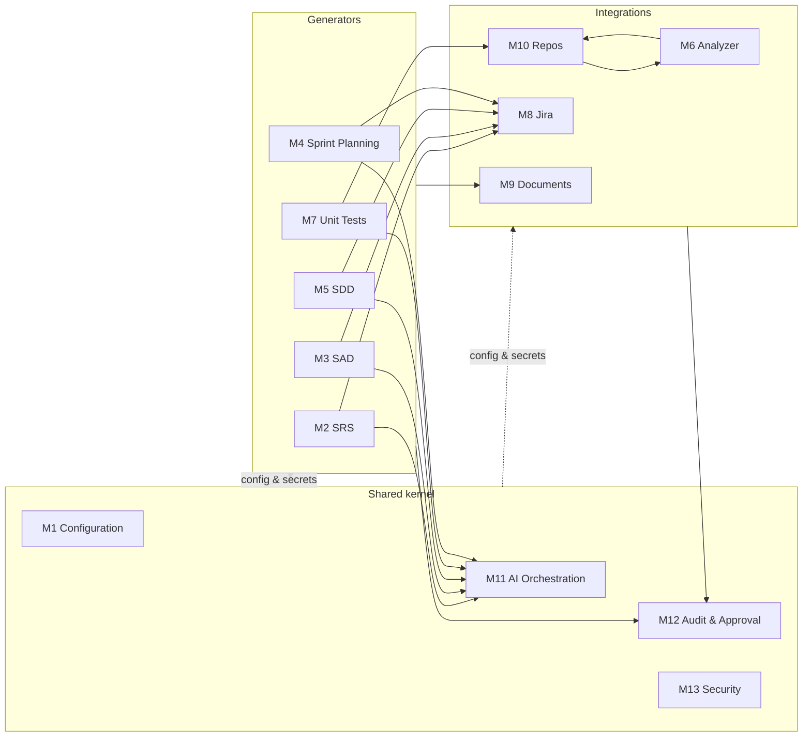

# 2. Solution Architecture

Covers specification output sections **§3 High-Level Solution Architecture**, **§4 Technology Stack Recommendation**, and **§5 Windows Application Framework Recommendation**.

## 2.1 Architectural style

**Clean Architecture** with **MVVM** in the presentation layer. Dependencies point inward only:

- **Domain** has zero dependencies: entities, value objects, invariants (e.g. `SprintCalendar.Validate(estimate)`).
- **Application** defines every port (interface) and all use-case orchestration, including the audit write-gate. It never references vendor SDKs.
- **Infrastructure** contains one adapter per external system. Each adapter is independently replaceable (spec requirement).
- **Presentation** is WPF/MVVM; view-models call use cases only. No business logic in views or view-models.

## 2.2 The write-gate — the load-bearing pattern

Every state-changing operation is modeled as an `IAuditedOperation` and executed only through the pipeline:

Properties this guarantees structurally:

1. **Audit-before-execute** — the PENDING record is durably flushed before anything else happens (Rule 9).
2. **Block on audit failure** — an audit write failure aborts the operation (Rule 10).
3. **No unapproved writes** — adapters are only reachable through the gate; DI registers write services exclusively behind the decorator (Rules 1–3).
4. **Rollback data by construction** — previous state is captured before the write, enabling M12 rollback.

## 2.3 Runtime composition

`Microsoft.Extensions.Hosting` generic host bootstraps inside WPF's `App`:

- **DI**: constructor injection everywhere; module registration via `IServiceCollection` extension per module (`AddSrsModule()`, `AddAuditFramework()`, …) so modules stay independently replaceable.
- **Configuration**: profile JSON (validated against the published schema) → strongly-typed `IOptionsMonitor<T>` records; hot-reload for non-credential settings.
- **Background work**: `IHostedService` for the audit indexer, Jira sync checks, and long-running generations; UI stays responsive (Rule 14 — async everywhere).
- **Messaging**: `CommunityToolkit.Mvvm` `IMessenger` for decoupled UI events (e.g. approvals-badge updates).

## 2.4 Technology stack recommendation

| Layer | Technology | Version | Justification |
|---|---|---|---|
| Runtime | .NET | 8 (LTS) | Long-term support to Nov 2026+; single runtime for all layers |
| UI | WPF + CommunityToolkit.Mvvm | 8.x | Mature MVVM tooling, source-generated observables/commands |
| DI/Hosting | Microsoft.Extensions.* | 8.x | Standard, first-party |
| Data | EF Core + SQLite | 8.x | Local, zero-install, transactional index |
| HTTP | HttpClientFactory + Polly | 8.x | Retry, circuit-breaker, timeout policies per integration |
| Logging | Serilog | 3.x | Structured logs, multiple sinks, correlation enrichment |
| Git | LibGit2Sharp | 0.30+ | In-process local repo analysis, no git.exe dependency |
| DOCX | Open XML SDK | 3.x | First-party, template-safe document assembly |
| PDF | QuestPDF | 2024.x | Modern layout engine (Community license tier — verify org revenue eligibility; fallback: wkhtmltopdf-free HTML→PDF via Playwright print, or paid license) |
| Markdown | Markdig | 0.34+ | CommonMark-compliant MD→HTML |
| Diagrams | Native mxGraph XML writer | — | draw.io files are plain XML; no dependency needed to produce them |
| Excel/Word ingest | Open XML SDK / ClosedXML | — | Sprint-plan input formats (M4) |
| Validation | JsonSchema.Net | 5.x | Profile validation against published schema |
| Testing | xUnit + NSubstitute + FluentAssertions | — | See doc 13 |

## 2.5 Windows application framework recommendation (§5)

**Recommendation: WPF on .NET 8** — confirmed by the user. Justification against alternatives:

| Criterion | WPF (.NET 8) | WinUI 3 | Electron | JavaFX |
|---|---|---|---|---|
| Enterprise maturity / longevity | ✅ 18+ years, LTS | ⚠️ younger, churn | ⚠️ runtime churn | ⚠️ niche on desktop |
| MVVM & data-binding depth | ✅ best-in-class | ✅ good | ❌ n/a | ⚠️ moderate |
| Rich docking/diagram/grid controls | ✅ largest ecosystem | ⚠️ growing | ⚠️ web widgets | ⚠️ limited |
| Native secret storage (DPAPI) | ✅ direct | ✅ direct | ⚠️ via native modules | ⚠️ via JNI |
| Memory/footprint for a long-running tool | ✅ | ✅ | ❌ heavy | ⚠️ |
| Packaging (MSIX + MSI/EXE fallback) | ✅ both | ⚠️ MSIX-centric | ✅ | ✅ |
| Fit for audit-heavy, offline-capable enterprise app | ✅ | ✅ | ⚠️ larger attack surface | ⚠️ |

WPF wins on ecosystem maturity and enterprise control coverage (virtualized grids for the audit dashboard, diff viewers, docking). The Clean Architecture split keeps >85% of the codebase UI-framework-agnostic, so a later WinUI 3 or cross-platform (Avalonia) presentation layer is a bounded rewrite of `SprintForge.Wpf` only.

## 2.6 Module topology

All 14 modules are vertical slices over the shared kernel (audit, approval, configuration, AI orchestration):

