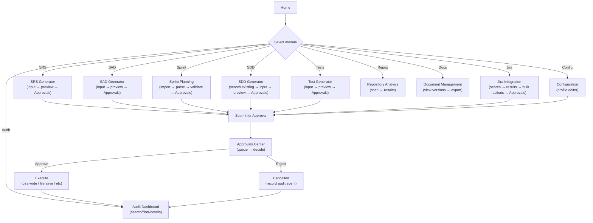

# 5. UI/UX Design

Covers specification output section **§9 UI/UX Wireframes and Screen Flow**.

## 5.1 Design principles

- **Approvals Center is the write-gate UX** — no modal dialogs interrupt the workflow. Every write operation queues; the user opens the Approvals Center to decide.
- **Generators follow a three-zone pattern** — input form, versioned draft preview, action bar ("Submit for Approval"). Generators never write; they queue.
- **Audit dashboard is the system's source of truth** — every click on an approval or a Jira ticket traces back to its audit event, prompt, response, and affected files.
- **Profiles are lightweight** — one active profile at a time; switching profiles is an audited action. Profile editor is a tab in Configuration.
- **No hiding state** — validation errors, connection states, pending approvals all surface immediately in the relevant context (banner, badge, list).

## 5.2 Shell — main application container

```
┌─────────────────────────────────────────────────────────────────────┐
│  Profile: [Acme-Prod ▼]      SprintForge       [Audit ⚠️]       │  ← Top bar
├─────────┬───────────────────────────────────────────────────────────┤
│         │                                                             │
│  Home   │                                                             │
│ ▸ SRS   │                                                             │
│ ▸ SAD   │              WORKSPACE AREA (module-specific)              │
│ ▸ Sprint│                                                             │
│ ▸ SDD   │                                                             │
│ ▸ Repos │                                                             │
│ ▸ Tests │                                                             │
│ ▸ Jira  │                                                             │
│ ▸ Docs  │                                                             │
│ ▸ Audit │                                                             │
│ ▸ Config│                                                             │
│         │                                                             │
├─────────┴───────────────────────────────────────────────────────────┤
│ ⊙ Connected to JIRA      [Approvals: 3 pending ⏱️]   [v1.0]          │  ← Status bar
└─────────────────────────────────────────────────────────────────────┘
```

**Top bar:**
- Profile selector (dropdown, New/Clone/Delete options).
- Audit health indicator (⚠️ red if integrity check failed, ✓ green if OK).
- Real-time sync status (→ icon spinning if indexing).

**Left rail:**
- Navigation to each module + Home.
- Current module is highlighted.
- Collapsible (full keyboard support).

**Status bar:**
- Jira connection state + last sync time.
- **Approvals badge** — shows count of pending items; clicking navigates to Approvals Center. Non-blocking toast also appears when a new item is queued.
- App version.

## 5.3 Screen inventory

### Home
Brief overview: last 5 audit events (link to each), quick stats (profiles available, workspace size, Jira projects, repos analyzed), access to configuration.

### SRS Generator (M2)
**Three-zone layout:**

```
┌─ Input ─────────────────────────────────────────────────────────────┐
│ Brief description: [________________]                               │
│ SRS ID:           [PROJ-1234_____]                                  │
│ Template:         [Default SRS ▼]                                   │
│ [Load from template]  [Clear]                                       │
├─ Preview (versioned) ────────────────────────────────────────────────┤
│ ┌─ Versions ──────────┐  [Compare v1 vs v2] [Restore to v1]        │
│ │ v001 2024-12-15 (draft)                                           │
│ │ (none previously)                                                 │
│ └─────────────────────┘                                             │
│                                                                      │
│ # SRS: PROJ-1234                                                   │
│ ## Functional Requirements                                          │
│ - User shall...                                                     │
│ ## Non-functional Requirements                                      │
│ ...                                                                 │
│ [AI explanation visible but read-only in preview]                   │
├─ Action ────────────────────────────────────────────────────────────┤
│ [Regenerate] [Download as DOCX] [Download as PDF]                   │
│ [Submit for Approval] → queues to Approvals Center                  │
└─────────────────────────────────────────────────────────────────────┘
```

**Interaction:**
- Changing input auto-triggers regeneration (with "Generating..." spinner).
- Version Compare shows side-by-side diff with section-level highlighting.
- Restore creates a new version from a previous one (not a rollback; every action is audited new).
- Submit for Approval queues the current draft to the Approvals Center and shows a confirmation toast.

### SAD Generator (M3)
Similar three-zone pattern:
- **Input:** ticket reference (Jira issue key), architecture style (e.g., microservices, monolith), technology stack (pre-filled from config, editable), service list (multi-select from repo analyzer results).
- **Preview:** generated Draw.io XML preview (rendered as a diagram mockup or XML tree view), plus SAD markdown document.
- **Action:** "Generate Diagrams," "Download Architecture XML," "Download Architecture PNG," "Submit for Approval."

### SDD Generator (M5)
- **Input:** service/class name (autocomplete from repo analyzer), search scope (current project or all configured projects), format (DOCX/PDF/MD).
- **Search step (first):** shows "Searching for existing SDD in [PROJ, PLAT, ...]" + results list. User can select an existing SDD to view/edit or proceed to generate new.
- **Preview:** generated SDD document with methods, dependencies, test cases, coverage matrix.
- **Action:** "Compare with existing," "Submit for Approval," "Attach to Jira."

### Sprint Planning (M4)
- **Input:** import source picker (Confluence page URL / Markdown text / Excel file upload / Word file upload).
- **Parse step:** shows parsed stories/tasks in a tree view with inline details pane (estimate, assignee, priority).
- **Validation banner:** if any estimate exceeds configured dev days, shows "⚠️ 3 subtasks exceed dev-day budget; review below" with a filter link to show only oversized items.
- **Action:** "Adjust estimates," "Push to Jira" → queues all items to Approvals Center as a single batch with per-item diffs.

### Repository Analysis (M6 + M10)
- **Input:** select repositories from config; optional branch filter.
- **Scan results:** classes/services detected, external calls identified, dependency graph (mermaid diagram or interactive tree).
- **Action:** "Recommend for SDD," "Export impact report."

### Unit Test Generator (M7)
- **Input:** repository (dropdown), service/class (autocomplete), coverage target (slider, default from config), test framework (dropdown).
- **Preview:** generated test code (JUnit/pytest/Jest/…) with positive, negative, boundary, and exception cases.
- **Action:** "Generate and save to repo," "Submit for approval," "Coverage matrix."

### Jira Integration (M8)
- **Search pane:** query builder (JQL text editor or visual filter builder) with "Run search" button.
- **Results:** issue list with columns: Key, Summary, Status, Assignee, Story Points. Clicking an issue shows its detail + audit trail (all updates made by the app, links to this tool).
- **Bulk actions:** "Transition selected," "Update custom fields," "Link to Epic," "Attach SDD," etc. All queue to Approvals Center.

### Documents (M9)
- **Overview:** list of all generated documents by type (SRS, SAD, SDD, Tests, etc.) with version counts, dates, export formats.
- **Actions:** "View version history," "Compare versions," "Export (DOCX/PDF/MD)," "Delete version," "Publish to Confluence (future)."

### Audit Dashboard (M12) — The jewel
**Tabbed interface:**

1. **Timeline** — vertical audit log, newest first. Each entry shows action (e.g. "Jira: create issue PROJ-2345"), status, time, and a link to details.
2. **Tree** — parent/child audit event relationships (e.g., "SRS submission" → "AI prompt" + "AI response" → "Jira update" → "approval decision").
3. **Sessions** — group events by user session; shows session start, end, actions performed.
4. **Jira** — all Jira-related events; filter by project, issue, action.
5. **AI Prompts** — all AI calls; show prompt, model, response, tokens used; "replay" button to re-run the identical call.
6. **Files** — all documents created/modified; filter by type, date range.
7. **Approvals** — approval queue history; show current vs proposed, decision, who approved, timestamp.
8. **Rollbacks** — rollback operations and their outcomes.

**Master list + detail pane:**
- Master list on the left (virtualized for thousands of events); filter/search at the top (module, action, status, date range, correlation ID).
- Clicking an event shows detail pane on the right: full inputs, outputs, prompt text, response text, affected files, execution metrics (time, retries, API calls made), related parent/child events.

### Configuration (M1 + M13)
**Profile selector + tabbed editor:**

```
Active profile: [Acme-Prod ▼]  [New] [Clone] [Delete]

Tabs: [Jira] [AI] [Templates] [Working Dir] [Sprint] [Repos] [Preferences] [Logging] [Audit]

┌─ Jira tab ──────────────────────────────────────┐
│ Server URL: [https://acme.atlassian.net_____]   │
│ Username:   [user@acme.com_________________]    │
│ Auth mode:  [API Token ▼]                       │
│ Token:      [••••••••••••]  [Test Connection]   │
│ API Dialect:[Cloud v3 ▼]                        │
│                                                  │
│ Projects:   [PROJ, PLAT, ...] [+Add] [-Remove]  │
│ Components: [payments, auth] [+Add] [-Remove]   │
│                                                  │
│ ✓ Connection OK (last verified 2 hours ago)     │
│ [Save]  [Cancel]                                │
└──────────────────────────────────────────────────┘
```

Each tab has a "Test Connection" or "Validate" button. Saving a profile is an audited write queued to Approvals Center. Secrets are never shown; only ciphertext handles displayed.

### Approvals Center (The write-gate UX)
**The only place writes happen:**

```
┌─ Approvals Center ───────────────────────────────────┐
│ Queue (3 pending)           [Clear all]              │
├──────────────────────────────────────────────────────┤
│                                                      │
│ ☐ [SRS-2024-12-15-001] Jira: Create issue PROJ-1234│  Batch #1
│   ┌────────────────────────────────────────────────┐│
│   │ Current:   (none)                              ││
│   │ Proposed:  PROJ-1234: Requirements for X      ││
│   │ Audit ID:  01ARZ3NDEKTSV4RRFFQ69G5FAV         ││
│   │ AI Explanation: Generated SRS from brief...   ││
│   │ Affected fields: [Summary, Description, ...]  ││
│   │ Generated files: /Docs/SRS/PROJ-1234/v001.pdf ││
│   │                                                ││
│   │ [Approve] [Modify] [Reject] [Cancel]          ││
│   └────────────────────────────────────────────────┘│
│                                                      │
│ ☐ [SPR-2024-12-15-002] Jira: Create 12 subtasks   │  Batch #2
│   ┌────────────────────────────────────────────────┐│
│   │ PROJ-1234-1: Implement feature X     Est: 8h  ││
│   │ PROJ-1234-2: Write unit tests        Est: 4h  ││
│   │ ... (10 more)                                  ││
│   │ [Approve All for this batch] [View batch diff] ││
│   │ [Approve] [Reject] [Cancel]                   ││
│   └────────────────────────────────────────────────┘│
│                                                      │
│ ☐ [CFG-2024-12-15-003] Update profile: Acme-Prod  │  Batch #3
│   ┌────────────────────────────────────────────────┐│
│   │ Current AI model:   claude-sonnet-4            ││
│   │ Proposed AI model:  claude-sonnet-5            ││
│   │                                                ││
│   │ [Approve] [Reject] [Cancel]                   ││
│   └────────────────────────────────────────────────┘│
│                                                      │
│ [Approve All]  [Cancel All]                        │
└──────────────────────────────────────────────────────┘
```

**Behavior:**
- Each item shows current vs proposed state with a **diff highlight** (additions in green, deletions in red).
- Audit ID is always visible (for traceability).
- **Approve All** applies to every item in the queue.
- **Modify** opens an in-place editor (for quick tweaks before approval).
- **Reject** removes the item and records a "REJECTED" audit event.
- **Cancel** aborts the operation and records "CANCELLED" (user changed mind).
- Once approved, the item transitions to "Executing" state with a spinner, then either "Completed" (green) or "Failed" (red with error details).

## 5.4 Navigation flow



## 5.5 Key UX patterns

### Write-gate pattern (all modules)
1. User prepares input + clicks "Submit for Approval."
2. Operation is queued to Approvals Center with a pre-recorded audit entry.
3. Status bar badge updates to show pending count.
4. User navigates to Approvals Center.
5. User reviews and decides per item (or Approve All).
6. On approval, the write executes and status updates to "Completed" (or "Failed" if there's an error).
7. Audit trail is complete: PENDING → APPROVED → EXECUTING → COMPLETED (with timing, retries, any errors).

### Versioning (SRS, SAD, SDD, tests, docs)
- Every regeneration or user edit creates a new version (v001, v002, …).
- "Compare" shows section-level diffs between versions.
- "Restore" creates a new version from an old one (not destructive; all versions retained).
- Version manifest in the audit record links every artifact file to its audit event.

### Search + results workflow (SDD, Jira, Repos)
- User supplies query + clicks "Search" / "Run query" / "Scan."
- Results list is virtual-scrolled (thousands of items, no lag).
- Click an item to see detail pane.
- Bulk-select items → bulk action → queue to Approvals Center.

### Audit drill-down (dashboard + everywhere)
- Any approval, Jira ticket link, audit event link opens the Audit Dashboard filtered to that event's correlation ID.
- Detail pane shows all related events, inputs, outputs, prompt, response, files.
- "Replay" button on AI prompts re-runs the identical call.

## 5.6 Keyboard & accessibility

- **Keyboard shortcuts:** Tab through approvals items, Enter to expand, A to approve, R to reject, C to cancel.
- **Screen reader:** every list item has a descriptive aria-label; diffs are described textually as well as highlighted.
- **Contrast:** WCAG AA minimum on all text + backgrounds.
- **Dyslexia-friendly font:** configurable in Preferences (e.g., Dyslexie, OpenDyslexic).
